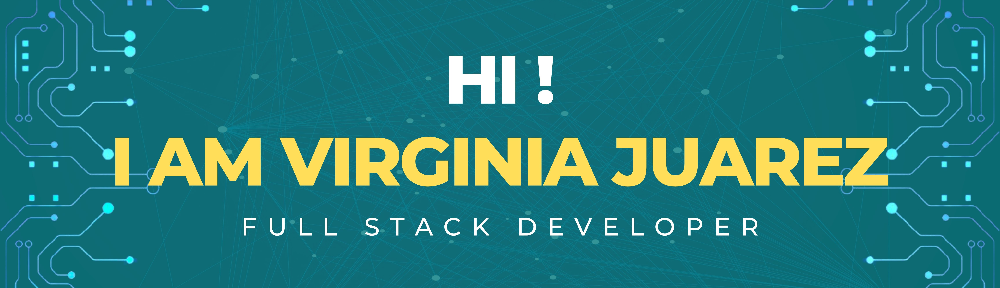

### 

<h3 align="center"><strong>Full Stack Developer 👩‍💻 with scientific academic
background 🧪.</strong></h3>
<h4 align="center">I am passionate about new challenges,
and try to solve them with logic thinking and tenacity. I
am a curious person, I learn quickly and always perfomn
my job in a responsible and dedicated way</h4>

<!--
CONTACTO
-->

<h4><strong>Connect with me:</strong></h4>

## Languages and Tools
______________________

 
<!-- html -->
 
<!-- css -->
 
<!-- js -->
 
<!-- typescript -->
  
<!-- react -->
 
<!-- redux -->
 
<!-- nodejs -->
 
<!-- express -->
 
<!-- postressql -->
 
<!-- mysql -->
  
<!-- materialUI -->
  

  

## Github Stats  
_______________

  

   

## Projects
👇
👇
👇   
____________________
## Food App

~~~
📌 Henry Bootcamp Individual Project 
I worked as a Full-Stack Developer

Design and develop a web page about recipes including:
◉ Searchbar
◉ Filtering, Sorting and Pagination
◉ Option to create a recipe

Tech Utils: 
◉ Javascript
◉ ReactJS
◉ Redux
◉ Plain CSS 
◉ NodeJS
◉ Express
◉ PostgreSQL
◉ Sequelize
~~~

____________________
## World-Game  

~~~
📌 A mobile game developed to make geography more fun 🌎🌍🌏

Final group project of Bootcamp Henry. 
I worked as Front-End & Mobile Developer. 

The project has a mobile version, a web version and an administrator panel.

Tech Utils:
🎮 Database: PostgreSQL
🎮 Back-End: NodeJs, Express, Sequelize
🎮 Front-End: React JS, React Native, Redux, Tailwind, Material-UI, HTML
🎮 Additional Libraries: 
✔ Socket-IO (Integrated chat)
✔ Chart.js (Real-time graphs)
✔ Stripe (Payment gateway)
✔ Cloudinary (Upload profile picture)
✔ Nodemailer (Sending of mails)
~~~
<h2>
Mobile Game
</h2>

  

<h2>
Administrator Panel
</h2>

  

<h2>
Web Game
</h2>

___________________________________________

## 📫 CONTACT ME

Do you want to work together?

**Email:** felipetau0@gmail.com

